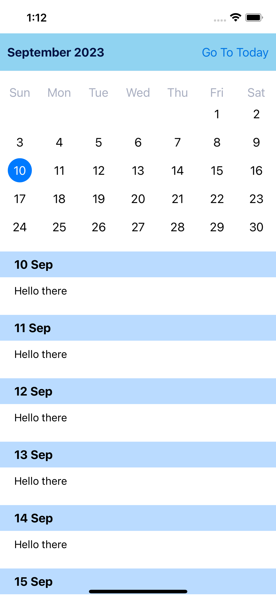
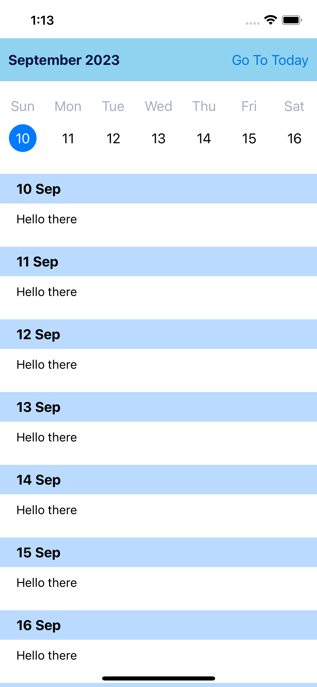

# Calendar

Calendar Month View | Calendar Week View
:-------------------------:|:-------------------------:
|

- **Project Overview:**
  - This project demonstrates the implementation of a calendar view in iOS using the JTAppleCalendar library.
  - The calendar supports multi-selection and single-selection modes, controlled through the `CalendarSelectionType` enum.
  
- **Main Components:**
  - `CalendarViewController`: A view controller that displays the calendar using `JTACMonthView`. It also includes a table view for displaying additional information.
  - `CalendarViewModel`: Manages the data and logic for the calendar view.
  - `CalendarDateCell`: Custom cell for rendering individual dates in the calendar.

- **Features:**
  - Supports both horizontal and vertical scrolling of the calendar.
  - Swipe gestures to navigate between months and toggle the number of rows displayed.
  - "Go to Today" button to quickly return to the current date.
  - Dynamic resizing of calendar rows for improved user experience.
  
- **Calendar Configuration:**
  - Calendar cells are customized based on their state (today, selected, unselected).
  - Month range and display options are configurable, including the number of rows displayed in the calendar.
  - Calendar data is generated using the `JTACMonthViewDataSource` and `JTACMonthViewDelegate` protocols.
  
- **Table View Integration:**
  - The calendar view is complemented with a table view for showing additional details related to selected dates.
  - The table view is managed by the `CalendarViewModel` and populates data using custom table view cells.
  
- **Date Handling:**
  - Various date manipulation functions are used to calculate start and end dates of months, handle date selection, and manage date ranges.

- **Readability and Maintainability:**
  - The code follows Swift best practices, including the use of protocols, extensions, and enums to improve readability and maintainability.
  - Custom cell classes are used for both the calendar and table view components, promoting code reusability.

- **ReactiveSwift Integration:**
  - The `ReactiveSwift` framework is used for managing and updating data, enhancing the overall reactivity of the calendar view.
  
- **GitHub Repository:**
  - The code is stored in a GitHub repository, making it accessible for collaboration and version control.

This README provides a high-level overview of the project's features and code structure, helping users and developers understand the functionality and architecture of the calendar view implemented in the iOS app.
